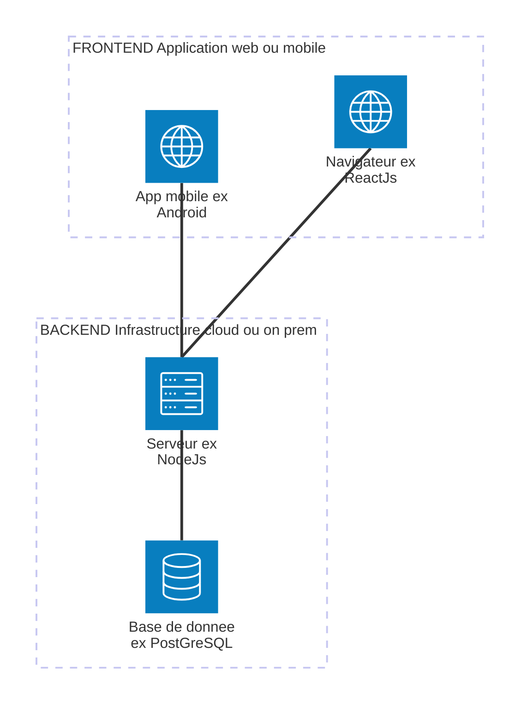

# Lunch Talk

Animation se déroulant entre midi et deux en mixité choisie, programmée pour et sur le Slack privé Yeeso.

## Principe général

Yeeso étant une association, les animatrices des lunch talk sont bénévoles. De plus la durée réduite (~1h) permettent une entrée en matière mais ne peut pas remplacer une formation.
La préparation des lunch talk doit pouvoir être minimale: ce sont plus des présentations et discussions ouvertes ("Ask me anything !") sur un sujet dédié.

L'important c'est les personnes présentes, afin de faciliter la prise de parole et le dynamisme de la session, les lunch talk ne sont pas enregistré. Toutefois si vous en ratez un ce n'est pas perdu, les sujets peuvent être rejoués pour plusieurs lunch talk.

Ce document peut permettre aux animatrices de préparer des notes, ou de partager des resouces, et au participantes de retrouver des resources ultérieurement.

## Sujets et notes des sessions

_A ajouter par date décroissante, aka les plus récent en haut._

### 06-01-2025 Les test, des tests unitaires aux test d'intégration

- Architecture d'une application web classique

- Description des tests de le leur cible sur cette app